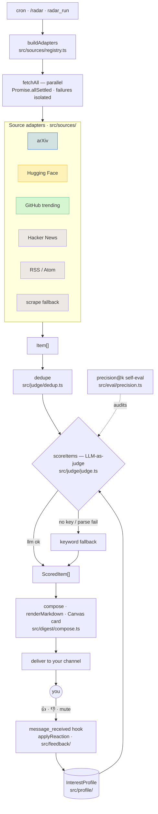

# Research Radar — an OpenClaw plugin

> A conversational, multi-source ML research radar for [OpenClaw](https://github.com/openclaw/openclaw).
> It pulls from arXiv, Hugging Face, GitHub, Hacker News, and curated researcher feeds, **scores every
> item for relevance with an LLM-as-judge**, **learns from your in-chat 👍/👎**, and delivers a daily
> digest to your channel that you can actually talk back to.

<p align="center"><em>📄 papers · 🤗 models · 🛠️ repos · 📝 posts — ranked for you, in the chat you already use.</em></p>

---

## Why this exists

Every "arXiv digest" tool is a **one-way email**, arXiv-only, ranked against a profile you set once and
never revisit. Running inside OpenClaw — an always-on, multi-channel personal assistant — lets the radar
do three things an email digest structurally can't:

1. **It's a conversation, not an inbox.** The digest lands as a numbered thread you interrogate:
   `summarize #3`, `why #5`, `more like #2`, `mute KV-cache`.
2. **It's multi-source.** Papers *and* model releases *and* trending repos *and* curated researcher blogs — not just arXiv.
3. **It learns.** Your 👍/👎 become few-shot exemplars that re-tune the relevance judge over time. The
   ranking quality is measurable: the project ships a **precision@k** self-eval over a labeled set.

That feedback→ranking loop is a small **LLM-as-judge / evaluation system** — which is rather the point.

## Features

- **Sources** (pluggable adapter per source): arXiv (per-category), Hugging Face trending models,
  GitHub trending ML repos, Hacker News, and RSS/Atom feeds. Sites without a feed (e.g. gwern.net,
  Anthropic news) use a **scrape fallback** — RSS preferred, scrape when there's no feed.
- **LLM-as-judge relevance** using the agent's own configured model (`api.runtime.llm.complete`), with a
  dependency-free **keyword fallback** when no model is available — so it always produces a digest.
- **Learns from feedback**: 👍/👎/`mute` in chat update your interest profile (capped exemplar memory).
- **Per-source failure isolation**: one dead feed never sinks the digest.
- **precision@k self-eval** (`src/eval/precision.ts`) to measure ranking quality on a golden set.
- **Runs offline / standalone**: a `--dry-run` CLI executes the full pipeline against fixtures with no
  network and no API key — handy for development and CI.

## Conversational interface

| You say | What happens |
|---|---|
| `/radar` (or tool `radar_run`) | Fetch → dedupe → score → deliver today's digest |
| `summarize #3` | Summary of item #3 from the last digest |
| `why #5` | The judge's rationale for including #5 |
| `more like #2` / 👍 on #2 | Adds a positive exemplar; future digests lean this way |
| 👎 on an item | Negative exemplar |
| `mute <topic>` | Suppresses a topic from future digests |
| `radar_sources` | Lists configured sources |

Reactions are captured via OpenClaw's `message_received` hook and persisted to your interest profile.

## How it works



<details><summary>Same flow as plain text</summary>

```
cron / "/radar"
      │
      ▼
 buildAdapters ──► fetchAll (parallel, Promise.allSettled — failures isolated)
                        │
                        ▼
                     dedupe ──► scoreItems (LLM-as-judge ⟂ keyword fallback)
                                      │
                                      ▼
                                  compose ──► renderMarkdown + Canvas card ──► your channel
                                                                                     │
                                          profile ◄── applyReaction ◄── 👍/👎/mute ◄─┘
```

</details>

📖 **[Full docs & self-demoing page →](https://arslankazmi.github.io/research-radar/)**

The **core pipeline is pure TypeScript with zero SDK dependency** — every unit is dependency-injected and
unit-tested. A thin entry (`src/plugin/index.ts`) wires it to the OpenClaw plugin API.

### Architecture

| Area | Path |
|---|---|
| Shared types & ports | `src/types.ts`, `src/contracts.ts` |
| Source adapters + registry | `src/sources/` |
| Relevance judge + dedup | `src/judge/` |
| Interest profile | `src/profile/` |
| Feedback loop | `src/feedback/` |
| precision@k eval | `src/eval/` |
| Digest compose + render | `src/digest/` |
| Pipeline (the heart) | `src/pipeline.ts` |
| Node runtime adapters | `src/runtime/` |
| CLI | `src/cli.ts` |
| OpenClaw plugin entry | `src/plugin/` |

## Install (OpenClaw)

This is an OpenClaw plugin. Publish/install it through the `clawhub` CLI, which bundles the
`@openclaw/plugin-sdk` at publish time (the SDK is not distributed on npm):

```bash
clawhub package publish        # from this directory, to publish
openclaw plugins add @arslankazmi/openclaw-research-radar
openclaw plugins inspect research-radar --runtime --json   # verify tools/contracts registered
```

Configure delivery (channel + time) in your OpenClaw config; defaults live in `src/config.default.ts`.
Cron uses `api.session.workflow.scheduleSessionTurn` when available, and otherwise instructs the agent
to schedule `radar_run` via the built-in `cron` tool.

## Develop & verify (standalone, no OpenClaw runtime needed)

```bash
npm install
npm run typecheck      # tsc --noEmit
npm test               # vitest — full unit suite
npm run dry-run -- --offline   # run the whole pipeline on fixtures, print a digest
```

## Configuration

Edit `src/config.default.ts` (or supply `--config <path>` to the CLI). Each source:

```ts
{ id: "arxiv-cs-lg", type: "paper", adapter: "arxiv",
  options: { categories: ["cs.LG"], maxResults: 20 } }
```

Adapters: `arxiv`, `huggingface`, `github-trending`, `hackernews`, `rss`, `scrape`. The interest
profile (`interests`, `keywords`, `mutedTopics`, `exemplars`, `minScore`, `topN`) is stored as JSON in
the OpenClaw workspace and evolves as you react.

## Status

v0.1 — core pipeline, all adapters, judge + feedback loop, precision@k eval, CLI, and the OpenClaw
entry are implemented and unit-tested. Some curated feed URLs are best-effort (see comments in
`src/config.default.ts`); the scrape fallback covers feedless sites.

## License

MIT © Arslan Kazmi
